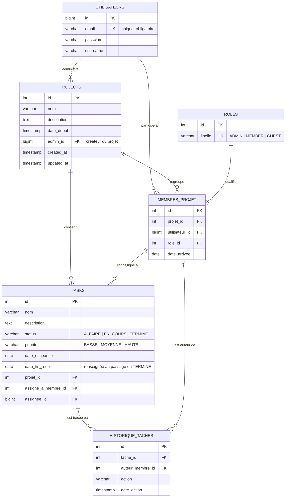

# PMT – Project Management Tool · Backend

API REST de la plateforme de gestion de projet collaboratif **PMT**, développée avec
Java 21 et Spring Boot 3.5.

| | |
|---|---|
| **Backend** (ce dépôt) | Spring Boot 3.5 / Java 21 / PostgreSQL 15 — [PMT-Project](https://github.com/mikeHelderal/PMT-Project) |
| **Frontend** | Angular 21 / Taiga UI / Jest — [PMT-Visual](https://github.com/mikeHelderal/PMT-Visual) |

> Le dépôt `PMT-Front` est une première tentative de frontend, abandonnée. Il ne fait pas
> partie des livrables : le frontend de référence est **PMT-Visual**.

---

## Sommaire

1. [Architecture](#1-architecture)
2. [Déploiement avec Docker](#2-déploiement-avec-docker-recommandé)
3. [Lancement en local](#3-lancement-en-local-sans-docker)
4. [Base de données](#4-base-de-données)
5. [Rôles et permissions](#5-rôles-et-permissions)
6. [API](#6-api)
7. [Tests et couverture](#7-tests-et-couverture)
8. [Pipeline CI/CD](#8-pipeline-cicd)
9. [Dépannage](#9-dépannage)

---

## 1. Architecture

La stack se compose de trois conteneurs orchestrés par `docker-compose.yml` :

```
  navigateur
      │
      ▼  :4200
┌──────────────┐      :8081      ┌──────────────┐      :5432      ┌──────────────┐
│   pmt-ui     │ ───────────────▶│   pmt-api    │ ───────────────▶│    pmt-db    │
│ Angular 21   │   REST / JSON   │ Spring Boot  │      JDBC       │ PostgreSQL15 │
│ nginx:alpine │                 │ JRE 21       │                 │              │
└──────────────┘                 └──────┬───────┘                 └──────────────┘
                                        │ SMTP
                                        ▼
                                  Mailtrap (notifications)
```

Le backend suit un découpage en couches classique :

```
controller/   Exposition REST (4 contrôleurs)
service/      Règles métier et contrôle des permissions
repository/   Accès aux données (Spring Data JPA)
model/        Entités JPA (6 tables)
DTO/          Objets de transport entrée/sortie
```

---

## 2. Déploiement avec Docker (recommandé)

### Prérequis

- Docker Engine 24+ et Docker Compose v2
- Les ports **4200**, **8081** et **5433** libres sur la machine hôte

### Procédure

```bash
# 1. Récupérer le dépôt backend (il porte le docker-compose de la stack complète)
git clone https://github.com/mikeHelderal/PMT-Project.git
cd PMT-Project

# 2. Renseigner les identifiants SMTP (facultatif : sans eux, l'application
#    fonctionne, seuls les e-mails de notification ne partiront pas)
cp .env.example .env
#    puis éditer .env → MAIL_USERNAME / MAIL_PASSWORD

# 3. Démarrer la stack (images tirées depuis Docker Hub)
docker compose up -d

# 4. Suivre le démarrage
docker compose logs -f backend
```

### Vérification

| Service | URL | Attendu |
|---|---|---|
| Interface | <http://localhost:4200> | Page de connexion PMT |
| API | <http://localhost:8081/api/projects/1> | JSON de la liste des projets |
| Swagger UI | <http://localhost:8081/swagger-ui.html> | Documentation interactive de l'API |
| Base | `localhost:5433` (user `postgres` / mdp `pmtpassword`) | 6 tables, jeu de test chargé |

### Comptes de démonstration

Chargés par `init-db/01_init_db.sql`, tous avec le mot de passe **`admin123`** :

| E-mail | Rôle sur le projet 1 |
|---|---|
| `admin@pmt.com` | ADMIN |
| `jean.dupont@pmt.com` | MEMBER |
| `marie.curie@pmt.com` | GUEST (observateur) |

### Arrêt

```bash
docker compose down        # arrête et supprime les conteneurs
docker compose down -v     # + supprime le volume : la base repart de zéro
```

> Le script `init-db/01_init_db.sql` n'est rejoué **qu'au premier démarrage** d'un volume
> vierge. Pour recharger le jeu de test, il faut donc passer par `down -v`.

### Construire les images en local

Les images publiées sur Docker Hub sont produites par la CI. Pour les reconstruire :

```bash
# Backend (depuis ce dépôt)
docker build -t mike230/pmt-backend:latest .

# Frontend (depuis le dépôt PMT-Visual)
docker build -t mike230/pmt-frontend:latest .
```

---

## 3. Lancement en local (sans Docker)

### Prérequis

- JDK 21, Maven (ou le wrapper `./mvnw` fourni)
- Une instance PostgreSQL 15 accessible avec une base `pmt_db`

```bash
# 1. Créer la base et charger le schéma + le jeu de test
createdb -U postgres pmt_db
psql -U postgres -d pmt_db -f init-db/01_init_db.sql

# 2. Démarrer l'API (port 8081)
./mvnw spring-boot:run
```

Les valeurs par défaut de `application.properties` ciblent
`jdbc:postgresql://localhost:5432/pmt_db` (`postgres`/`postgres`). Toutes sont surchargeables
par variable d'environnement, sans modifier le fichier :

| Variable | Défaut | Rôle |
|---|---|---|
| `SPRING_DATASOURCE_URL` | `jdbc:postgresql://localhost:5432/pmt_db` | URL JDBC |
| `SPRING_DATASOURCE_USERNAME` | `postgres` | Utilisateur base |
| `SPRING_DATASOURCE_PASSWORD` | `postgres` | Mot de passe base |
| `SPRING_JPA_HIBERNATE_DDL_AUTO` | `update` | Stratégie de schéma Hibernate |
| `SPRING_MAIL_HOST` / `SPRING_MAIL_PORT` | Mailtrap sandbox | Serveur SMTP |
| `SPRING_MAIL_USERNAME` / `SPRING_MAIL_PASSWORD` | *(vide)* | Identifiants SMTP |

> Aucun identifiant n'est versionné. Renseigner `.env` (voir `.env.example`) ou exporter
> les variables avant de lancer l'application.

---

## 4. Base de données

### Schéma relationnel



Le rôle d'un utilisateur n'est pas global : il est porté par la table d'association
`membres_projet`, ce qui permet d'être administrateur d'un projet et simple observateur
d'un autre.

### Script de génération

`init-db/01_init_db.sql` — structure complète des 6 tables **et** jeu de données de test.
Il est monté dans le conteneur PostgreSQL et joué automatiquement au premier démarrage.

---

## 5. Rôles et permissions

| Action | ADMIN | MEMBER | GUEST |
|---|:---:|:---:|:---:|
| Ajouter un membre et lui attribuer un rôle | ✅ | | |
| Créer une tâche | ✅ | ✅ | |
| Assigner une tâche | ✅ | ✅ | |
| Mettre à jour une tâche | ✅ | ✅ | |
| Visualiser une tâche | ✅ | ✅ | ✅ |
| Visualiser le tableau de bord | ✅ | ✅ | ✅ |
| Être notifié par e-mail | ✅ | ✅ | ✅ |
| Voir l'historique des modifications | ✅ | ✅ | ✅ |

Le contrôle est effectué côté serveur, dans la couche service. L'appelant s'identifie via
l'en-tête **`X-Member-ID`** (identifiant de sa ligne `membres_projet`), à partir duquel le
service résout son rôle sur le projet concerné.

> Conformément à l'énoncé, Spring Security n'est pas mis en œuvre : `X-Member-ID` est un
> mécanisme d'autorisation applicative, pas d'authentification.

---

## 6. API

Documentation interactive générée par springdoc-openapi :

- Swagger UI : <http://localhost:8081/swagger-ui.html>
- Spécification OpenAPI : <http://localhost:8081/v3/api-docs>

### Authentification — `/api/auth`

| Méthode | Chemin | Description |
|---|---|---|
| `POST` | `/register` | Inscription (username, e-mail, mot de passe). 409 si l'e-mail existe déjà. |
| `POST` | `/login` | Connexion par e-mail + mot de passe. Retourne l'utilisateur. |

```bash
curl -X POST http://localhost:8081/api/auth/register \
  -H "Content-Type: application/json" \
  -d '{"username":"Paul Martin","email":"paul@pmt.com","password":"secret"}'
```

### Projets — `/api/projects`

| Méthode | Chemin | En-tête | Description |
|---|---|---|---|
| `GET` | `/{userId}` | | Projets auxquels l'utilisateur participe |
| `GET` | `/project/{id}` | | Détail d'un projet |
| `POST` | `/` | | Création ; le créateur devient ADMIN du projet |
| `DELETE` | `/{id}` | `X-Member-ID` | Suppression (ADMIN uniquement) |

```bash
curl -X POST http://localhost:8081/api/projects \
  -H "Content-Type: application/json" \
  -d '{"nom":"Nouveau projet","description":"Description","dateDebut":"2026-05-01T09:00:00","adminId":1}'
```

### Membres — `/api/members`

| Méthode | Chemin | En-tête | Description |
|---|---|---|---|
| `GET` | `/project/{projectId}` | | Membres du projet et leurs rôles |
| `POST` | `/addMember/{projectId}` | `X-Member-ID` | Invitation par e-mail (ADMIN uniquement) |
| `PUT` | `/{id}` | `X-Member-ID` | Changement de rôle (ADMIN uniquement) |
| `DELETE` | `/{id}` | `X-Member-ID` | Retrait du projet (ADMIN uniquement) |

```bash
curl -X POST http://localhost:8081/api/members/addMember/1 \
  -H "Content-Type: application/json" -H "X-Member-ID: 1" \
  -d '{"email":"paul@pmt.com","roleName":"MEMBER"}'
```

Réponses d'erreur : `403` rôle insuffisant, `404` projet / utilisateur / rôle inconnu,
`409` utilisateur déjà membre.

### Tâches — `/api/tasks`

| Méthode | Chemin | En-tête | Description |
|---|---|---|---|
| `GET` | `/project/{projectId}` | | Tâches du projet |
| `POST` | `/` | `X-Member-ID` | Création (ADMIN ou MEMBER) |
| `PUT` | `/{id}` | `X-Member-ID` | Mise à jour complète, historisée |
| `PATCH` | `/{id}/status` | `X-Member-ID` | Changement de statut, historisé + e-mail |
| `PATCH` | `/{id}/assign` | `X-Member-ID` | Assignation à un membre, historisée + e-mail |
| `GET` | `/{id}/history` | | Historique des modifications, du plus récent au plus ancien |
| `DELETE` | `/{id}` | `X-Member-ID` | Suppression (ADMIN uniquement) |

```bash
# Créer une tâche
curl -X POST http://localhost:8081/api/tasks \
  -H "Content-Type: application/json" -H "X-Member-ID: 1" \
  -d '{"nom":"Rédiger la doc","description":"README complet","priorite":"HAUTE",
       "dateEcheance":"2026-05-15","project":{"id":1}}'

# Assigner la tâche 1 au membre 2 du projet 1
curl -X PATCH http://localhost:8081/api/tasks/1/assign \
  -H "Content-Type: application/json" -H "X-Member-ID: 1" \
  -d '{"projectId":1,"memberId":2}'
```

Le passage au statut `TERMINE` renseigne automatiquement `date_fin_reelle` ; tout autre
statut la remet à `null`.

---

## 7. Tests et couverture

```bash
./mvnw test      # tests unitaires et d'intégration seuls
./mvnw verify    # tests + génération du rapport JaCoCo
```

Rapport de couverture : **`target/site/jacoco/index.html`**

| | Instructions | Branches | Seuil exigé |
|---|---|---|---|
| Backend | 87 % | 76 % | 60 % |

Les tests s'exécutent sur une base **H2 en mémoire** (`src/test/resources/application-test.properties`),
sans dépendance à PostgreSQL. Ils combinent :

- `@WebMvcTest` + MockMvc + Mockito pour les 4 contrôleurs (couche web isolée) ;
- tests unitaires Mockito pour les 6 services (règles métier et permissions).

---

## 8. Pipeline CI/CD

Workflow : `.github/workflows/ci-backend.yml`, déclenché sur `push` et `pull_request` vers
`develop`.

```
checkout ──▶ JDK 21 (cache Maven) ──▶ mvn clean verify ──▶ login Docker Hub ──▶ build & push
                                      (tests + JaCoCo)                          pmt-backend:latest
```

Le push d'image n'a lieu que sur un `push` de branche : une pull request exécute les tests
sans publier d'image.

### Secrets GitHub à configurer

| Secret | Contenu |
|---|---|
| `DOCKERHUB_USERNAME` | Identifiant Docker Hub |
| `DOCKERHUB_TOKEN` | Access token Docker Hub (Account Settings → Security) |

Images publiées : `mike230/pmt-backend` et `mike230/pmt-frontend`.

---

## 9. Dépannage

| Symptôme | Cause probable | Solution |
|---|---|---|
| `dependency failed to start: container pmt-db is unhealthy` | PostgreSQL n'a pas fini de démarrer | Attendre, puis `docker compose up -d` à nouveau ; vérifier `docker compose logs db` |
| Port 5433 / 8081 / 4200 déjà utilisé | Autre service sur la machine | Modifier le mapping dans `docker-compose.yml` |
| Le jeu de test n'apparaît pas | Le volume existait déjà : le script d'init n'est joué qu'une fois | `docker compose down -v && docker compose up -d` |
| Les e-mails ne partent pas | `MAIL_USERNAME` / `MAIL_PASSWORD` non renseignés | Compléter `.env` puis `docker compose up -d --force-recreate backend` |
| `relation "roles" does not exist` en local | Schéma non chargé | `psql -U postgres -d pmt_db -f init-db/01_init_db.sql` |
